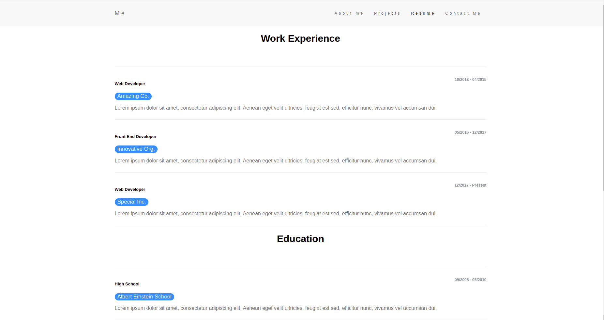
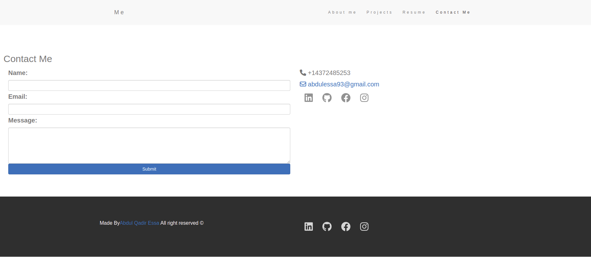

# React AQEssa Portfolio

In order to assess whether a potential employee is a good candidate for an open position, I would like to see their deployed React portfolio of work samples.

If I load a single-page application portfolio for a web developer, then I see a header, a content section, and a footer. After viewing the header, I am presented with the developer's name and navigation with titles corresponding to different sections of the portfolio. Upon viewing the navigation titles, I am presented with the titles About Me, Portfolio, Contact, and Resume, with the title corresponding to the current section highlighted. Clicking on a navigation title displays the corresponding section below the navigation without reloading the page and highlights that title. By default, the About Me section and title are selected when I load my portfolio for the first time. I see a recent photo or avatar of the developer when I am presented with the About Me section. The Portfolio section contains titled images of six of the developer's applications, along with links to both the deployed applications and GitHub repositories. The Contact section displays a contact form with fields for a name, an email address, and a message. Whenever I move my cursor out of a form field without entering text, I receive a notification that the field is required. If I enter an invalid email address into the email address field, I receive a notification. In the Resume section, I see a link to a downloadable resume and a list of the developer's skills. The footer displays links to the developer's GitHub, LinkedIn, and Stack Overflow profiles, as well as their profile on a third platform (Twitter, Stack Overflow).

# Getting Started with Create React App

This project was bootstrapped with [Create React App](https://github.com/facebook/create-react-app).

## Available Scripts

In the project directory, you can run:

### `npm start`

Runs the app in the development mode.\
Open [http://localhost:3000](http://localhost:3000) to view it in your browser.

The page will reload when you make changes.\
You may also see any lint errors in the console.

### `npm run build`

Builds the app for production to the `build` folder.\
It correctly bundles React in production mode and optimizes the build for the best performance.

The build is minified and the filenames include the hashes.\
Your app is ready to be deployed!

See the section about [deployment](https://facebook.github.io/create-react-app/docs/deployment) for more information.

## Learn More

You can learn more in the [Create React App documentation](https://facebook.github.io/create-react-app/docs/getting-started).

To learn React, check out the [React documentation](https://reactjs.org/).

### Deployment

This section has moved here: [https://facebook.github.io/create-react-app/docs/deployment](https://facebook.github.io/create-react-app/docs/deployment)

### `npm run build` fails to minify

This section has moved here: [https://facebook.github.io/create-react-app/docs/troubleshooting#npm-run-build-fails-to-minify](https://facebook.github.io/create-react-app/docs/troubleshooting#npm-run-build-fails-to-minify)

## Deployed Application Link
https://abdulqadir51.github.io/aqessa-portfolio/

## Screenshots

 
 
 
 

